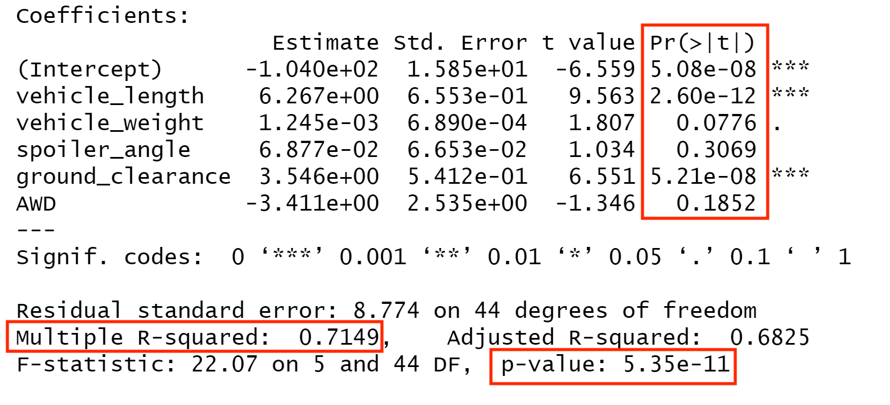
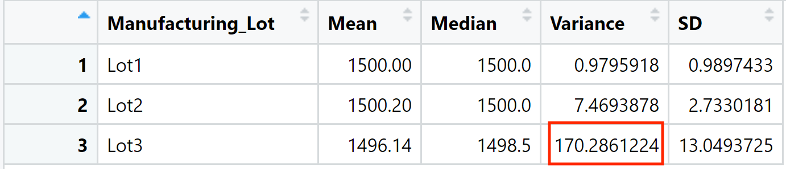
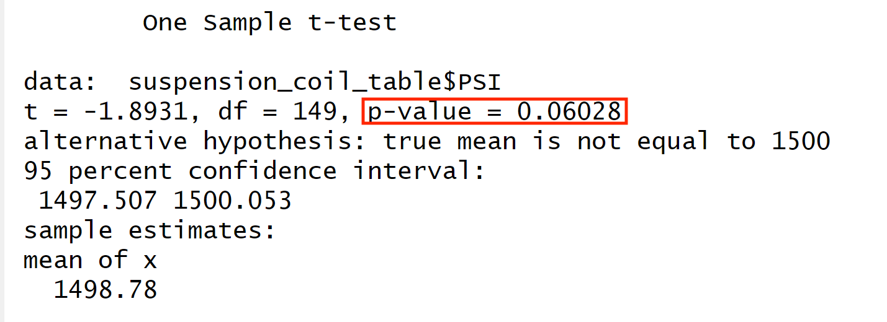
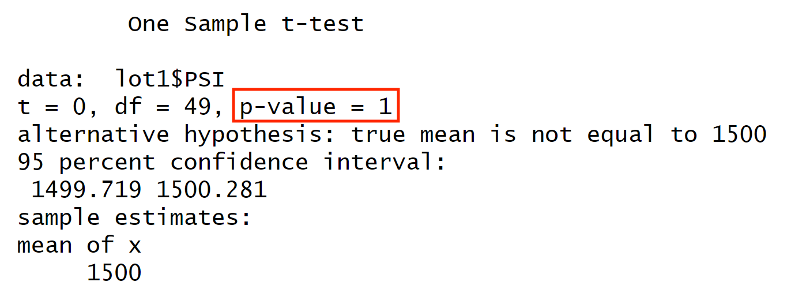
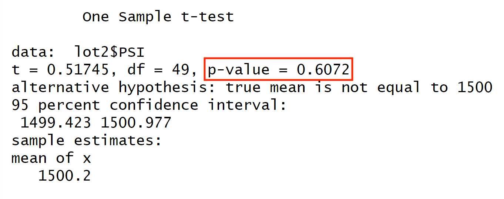
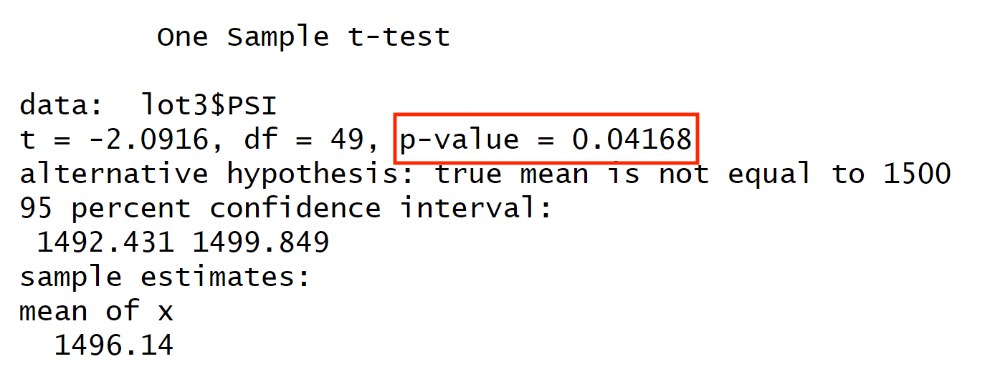

# MechaCar Statistical Analysis
## Overview
### Background
A new car prototype is suffering from production troubles that are blocking the manufacturing team's progress.
### Purpose
- Perform multiple linear regression analysis to identify which variables in the dataset predict the mpg of MechaCar prototypes
- Collect summary statistics on the pounds per square inch (PSI) of the suspension coils from the manufacturing lots
- Run t-tests to determine if the manufacturing lots are statistically different from the mean population
- Design a statistical study to compare vehicle performance of the MechaCar vehicles against vehicles from other manufacturers. 
## Linear Regression to Predict MPG
Using a linear regression model testing correlation between vehicle length, vehicle weight, spoiler angle, ground clearance, AWD, and MPG we got a p-value of 5.35e-11, and an R-squared value of 0.7149. Additionally, we can see that the variables, vehicle length, and ground clearance, provided a statistically significant amount of variance to the mpg values in the dataset. Based on or p-value, which is well below the required 0.05, we can reject the null hypothesis, meaning that the slope of the linear model is considered to be non-zero. The R-squared value indicates that this model can explain around 71% of the mpg outcomes. While this is not bad, for a company of this size, a model with a higher R-squared value is going to be necessary to make big decisions about what to change in the cars. 

## Summary Statistics on Suspension Coils
The design specifications for the MechaCar suspension coils dictate that the variance of the suspension coils must not exceed 100 pounds per square inch. Based on the summary tables, the manufacturing lots as a whole meet this design specification with a psi variance of 62.29. 

However, when breaking down the data further and grouping by lot, we can see that Lot3 has a psi variance of 170.29, which is far over the design specifications. 

## T-Tests on Suspension Coils
I ran t-tests to determine if the suspension coils of all manufacturing lots and each lot individually are statistically different from the population mean of 1,500 psi.
The t-test comparing all manufacturing lots to the population mean returned a p-value of 0.06, which using a significance level of 0.05 means we cannot reject the null hypothesis that the PSI of all lots is the same as the population mean.

The t-test comparing Lot1 to the population mean returned a p-value of 1, which means we cannot reject the null hypothesis that the PSI of all lots is the same as the population mean.

The t-test comparing Lot2 to the population mean returned a p-value of 0.6072, which means we cannot reject the null hypothesis that the PSI of all lots is the same as the population mean.

The t-test comparing Lot3 to the population mean returned a p-value of 0.04168, which means we can reject the null hypothesis that the PSI of all lots is the same as the population mean. This means that the true mean of Lot3 PSI is significantly different from the population mean of 1500.

## Analysis Summary
Based on the t-test results as well as the observed PSI variance happening at Lot3, I would recommend that a further, deeper analysis be carried out on Lot3 top see what is causing the cars from that location to be faulty.

## Study Design: MechaCar vs Competition
I would like to compare the cost, overall fuel efficiency, and safety rating of MechaCar vehicles with those of its competitors. I believe these will be the most useful metrics to compare because they are the numbers that consumers most look at when buying a new car. I would perform an ANOVA test for each metric comparing it to the same metric of multiple competitors. For this test, the null hypothesis would be that the metric is equal for all companies. The alternate hypothesis would be that at least one of the companies is different from all the others. Using an ANOVA would allow us to see how the metrics of the MechaCar vehicles stack up against multiple competitors. If the null hypothesis is rejected, we can then perform further t-tests with individual competitors to see if the MechaCars are significantly better, or worse. In order to run the ANOVA test we will need very large data sets from MechaCar as well as at least two competitors that contain cost, overall fuel efficiency, and safety ratings of their cars. 
